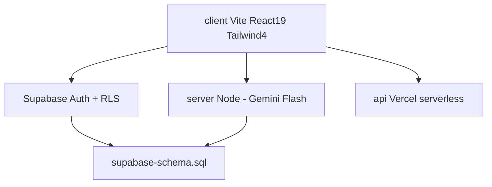

# Arsitektur ngampus-ai

- **Root**: `package.json` (concurrently `dev:server` + `dev:client`), `vercel.json`
- **client/**: `src/pages/Landing.jsx` (hero+slides+coverflow), `src/components/` — entry `src/main.jsx`
- **server/**: Node + Gemini — cek `server/package.json`
- **api/**: serverless Vercel
- **Env**: `.env.example` acuan — jangan commit secrets

## Skill relevan
- `shadcn` saat sentuh UI · `sonner` toast di `main.jsx` · `browser-use` verifikasi visual · `serena` code graph

## Foto landing
`public/FOTO UNTUK LEANDING PAGE/` — foto asli kampus (1200-1600px), bukan generate.

---
Lihat juga: [[00-index]] · [[decisions]]
